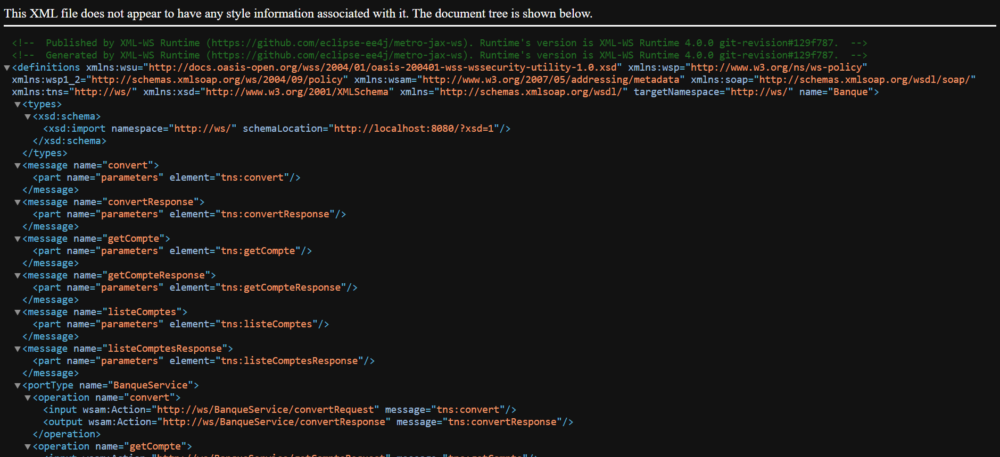
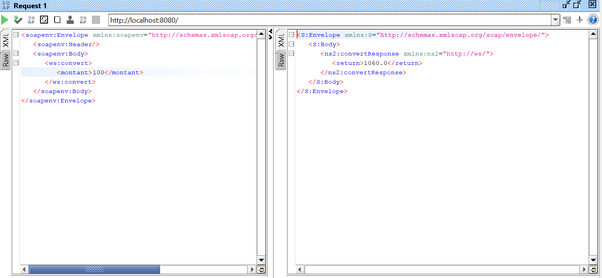
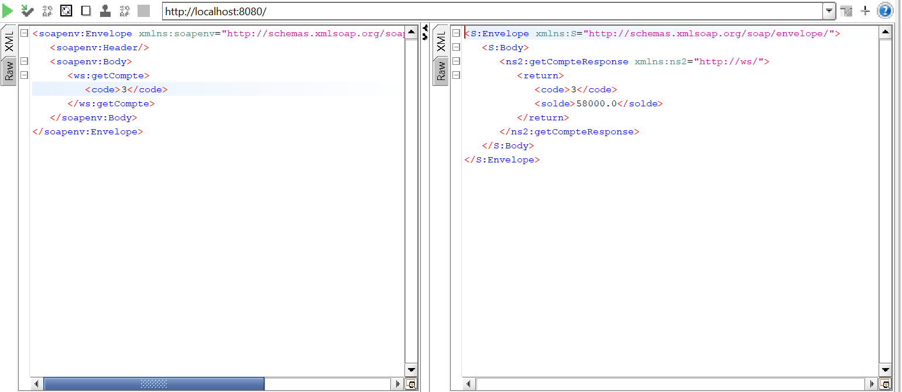
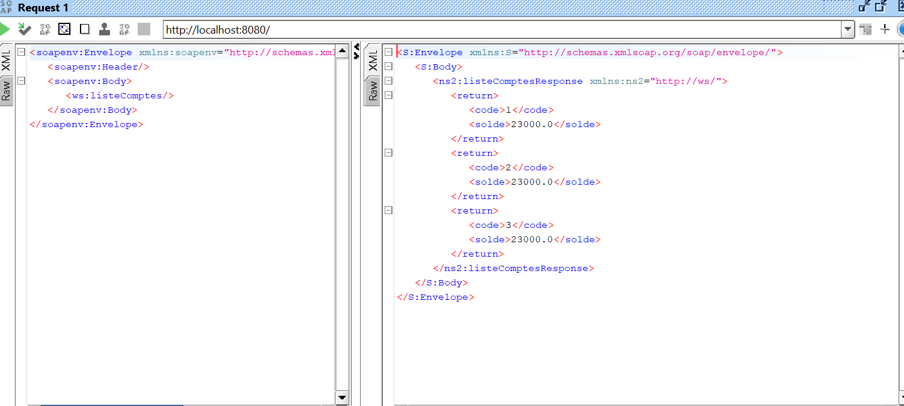
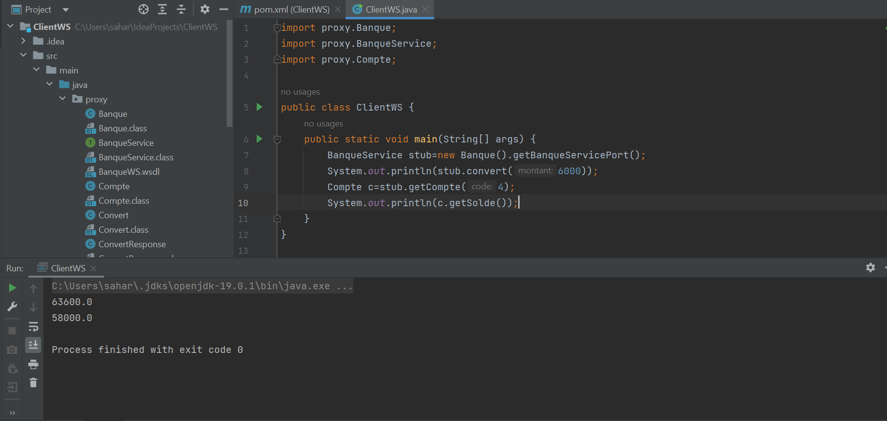

# TpWebServices_SOAP
<h1> Compte rendu </h1>
<h2> Web Service banque WSDL </h2>

<h3> Test du WEB SERVICE via SoapUI </h3>
<h2> methode convert </h2>

<h2> methode getCompte </h2>

<h2> methode listeCompte </h2>

<h2> Consommation du WebServices Banque par un client JAVA </h2>

